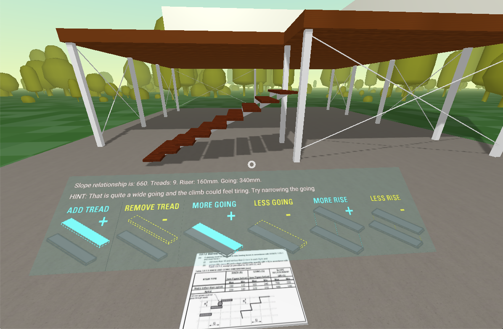

# aframe-react-staircase-example
## A simple test of AFrame with React, to explore basic staircase design.

**The UX is pretty terrible, I'd love to see what someone else would do to actually make something like this look nice and feel good to use.**  I've tried various events, buttons, overlays, and even gaze based interaction to provide controls, in the end I just settled on a raycaster and click event on some floating objects with textures. 

I haven't tested this with any VR headsets either, I don't have access to any. It was more about just having a play and seeing how AFrame worked, how it worked with React, and yeah, that's all!

Keep in mind that you'll **need a http-server otherwise AFrame won't load the textures**, I just use http-server which you can install with npm.

>https://www.npmjs.com/package/http-server

# Screenshot

